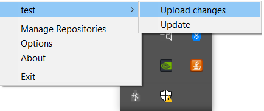

Working with WinGIN
====================

.. caution::

   **You have to obtain an account in Gin** to work with WinGIN.
   Refer to :ref:`registration` for more details.

Getting started
----------------

Download and install
^^^^^^^^^^^^^^^^^^^^^

The procedures are detailed in `the official wiki page <https://gin.g-node.org/G-Node/Info/wiki/WinGINTutorial>`_,
but some notes are:

- Download **as latest as possible**
  from `this installation repository <https://gin.g-node.org/G-Node/wingin-installers>`_
  (one from the "release" tab is better, but it seems there is none for the moment).
- **Don't forget to download ``Setup.msi``**, and save it in the same directory
  (with its name UNCHANGED) with ``WinGIN-install.exe``
- **Install Dokan as suggested by the installer**, unless you are sure what you are doing.

Where does WinGIN reside?
^^^^^^^^^^^^^^^^^^^^^^^^^^

You can find the GIN icon (below) on the system tray (where you have the icon for removing USB flash drives etc.):

.. image:: _static/gin-icon.png
   :alt: the GIN icon
   :scale: 25%

As you right-click on the icon, you can manage WinGIN settings such as available
repositories and repository updates.

On the initial launch, you will be asked about your logging information onto
`Gin <https://gin.g-node.org/>`_.

Checkout directory vs Mountpoint directory
^^^^^^^^^^^^^^^^^^^^^^^^^^^^^^^^^^^^^^^^^^^

There are **two directories correspoinding to a single repository**:

========================= ======================================
Directory type            Description
========================= ======================================
**Checkout directory**    Where the *real* files reside
**Mountpoint directory**  Where the *shortcuts* to files appear
========================= ======================================

The "mountpoint" is another virtual file system created by WinGIN.

The idea was: using the repository from this virtual file system, you can go
back and forth with different versions of files in the repository
(you cannot do it in the checkout directory i.e. in the context of Explorer).

However, there are some drawbacks: **in the curernt WinGIN, you cannot open or
edit files from the mount-point directory**.

So, unless you do care so much about different file versions, **you'd better
have access separately to checkout directories**. Otherwise you cannot edit
files in the repositories.

How to manage your repository
------------------------------

Creating a repository
^^^^^^^^^^^^^^^^^^^^^^

**An easy approach**: at first, it may be easier to understand if you create a
new repository from the Gin web interface. Then you can click on the "Checkout"
button from the "Manage repositories" menu of the system-tray icon to create a
local copy of your repository.

**Alternative approach**: from the "Manage repositories" menu from the system-tray
icon, you can click on the "Create" button to create a new repository.
Note that you have to specify the **repository path** (in the format: ``<username>/<repository name>``)
instead of just the name of the repository.

Updating a repository
^^^^^^^^^^^^^^^^^^^^^^

You can update your repository by adding/changing files:

1. **Add files** to the repository directory (can be either the checkout directory or the mountpoint directory).
2. **Edit files** in the repository directory (must be the checkout directory).
3. **Upload changes to the server**:

    1. Right-click on the system-tray icon. You will find the name of the repository.
    2. Select "(your repository)"->"Upload changes"
    3. A notification appears when upload procedure starts, and when it ends (or when it fails to upload).

