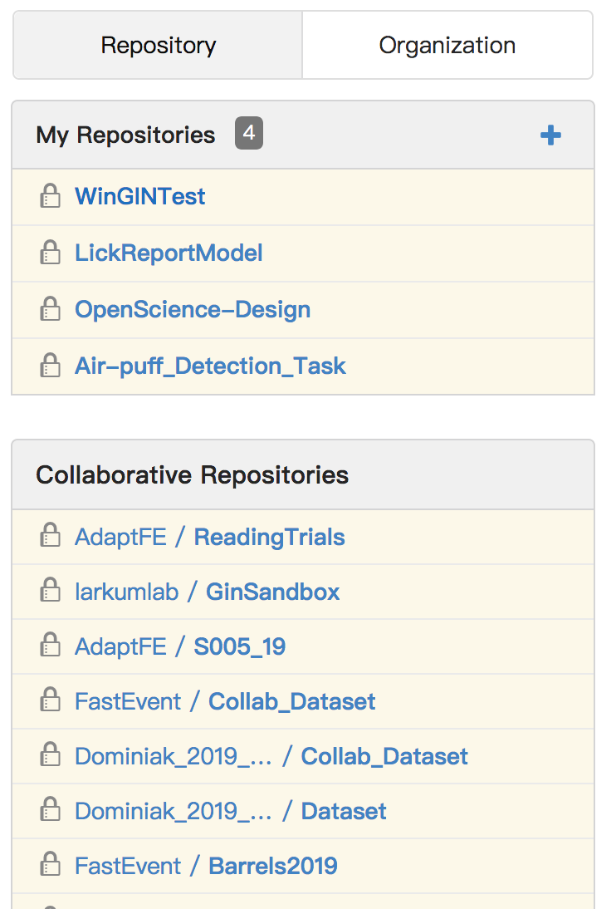
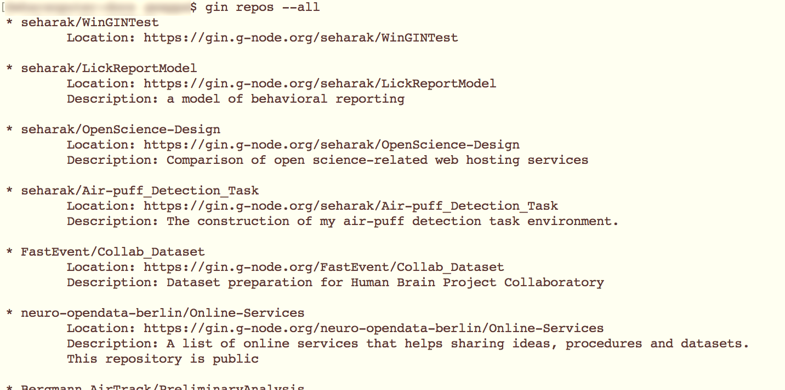
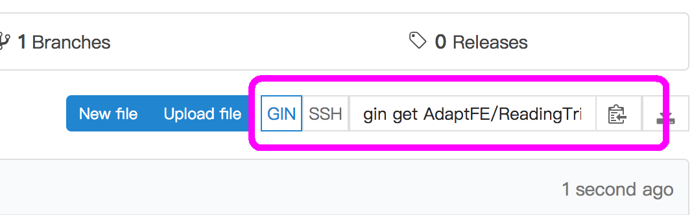

Gin Repository primer
=======================

.. admonition:: TODO

    add a nice image for each section

.. note::

   There are several different user interfaces, and each of them has its
   own advantages and disadvantages.
   Consult with :ref:`user-interfaces` for more details.

Identification of a repository
-------------------------------

A repository is identified based on the **name of the owner** and a unique **repository name**.

For example, if the user name is ``seharak`` and the repository name is ``TastingGin``,
you can specify the repository as ``seharak/TastingGin`` by joining the two components by a slash (``/``).

An **organization** (a group of users) can also be the owner of a repository.
For example, the organization ``larkumlab`` has this repository ``GinSandbox``.
To identify this repository, you can specify as ``larkumlab/GinSandbox``
(the repository is `here <https://gin.g-node.org/larkumlab/GinSandbox>`_).

You can check repository names in various ways, using the Gin web service (also
see :ref:`listing-repositories`):

- **On the repository page**: you can see its name (along with the name of the owner)
  on the top of the page (i.e. "AdaptFE/ReadingTrials" in this example).

  .. image:: _static/gin-web-repository-name.png
     :scale: 25%
     :alt:   Checking repository name from the repository page on the web.

- **On personal / organization page**: the repository names, without the owner name
  (which is this organization itself) can be seen.

  .. figure:: _static/gin-web-organization-reponame.png
     :scale: 25%
     :alt:   List of repositories on the organization page.

Accessing to a repository
--------------------------

In order to have an access to a repository, you have to:

- be **logged in as a user**:

    - **from the web interface**, you can use the "Sign in" button on the top-right corner.

      .. image:: _static/gin-web-signin.png
         :alt: The sign-in page of Gin web interface.
         :scale: 30%

    - **from WinGIN**, you will be prompted to log in on the first usage, and you are
      free from it afterwards.

      .. image:: _static/wingin-login.png
         :alt: The initial log-in prompt on WinGIN.
         :scale: 60%

    - **from Gin CLI**, you have to run ``gin login`` before working with repositories,
      but you are free from it afterwards.

      .. image:: _static/gin-cli-login.png
         :alt: ``gin login`` command.
         :scale: 50%

- have an **access-previlige to a repository**. This means either:

    - *you are the owner* of the repository. In this case, if you set it "private",
      no one else may be able to see your repository.
    - you are *a member of the owner organization* of the repository. In this case,
      even when it is set as "private", the members of the organization share the repository.

Creating a repository
----------------------

- Creating **on remote**:

    1. Go to *the page of the owner* i.e. if you want to create a repository under ``larkumlab``,
       you have to go to `its user page <https://gin.g-node.org/larkumlab>`_.
    2. Click on the green "New Repository" button.
    3. After some settings, you are done.

- Creating **locally**:

    - Using WinGIN, click on the "Create" button from the "Manage repositories" contextual menu.
    - Using Gin CLI, run ``gin create <owner name>/<repository name>``.
      An empty repository will be created (TODO: need to check).

.. _listing-repositories:

Listing available repositories
-------------------------------

Updating a repository
----------------------

A "commit" procedure is the only way to add a history on your repository.
It can optionally have so-called "commit message", which can be used to state
what you changed from the previous commit.

- **Committing locally**:

    - Using Gin CLI, you can run ``gin commit -m "...(message)..." .`` from any
      sub-directory of your repository (note that you don't have a way to stage/add individual files).
    - Using WinGIN desktop client, you can use the "Upload changes" contextual menu.

- **Committing remotely**:

    - You can edit or upload individual files using the **Gin web interface**.

      .. figure:: _static/gin-web-buttons.png
         :scale:    40%
         :align:    center
         :figwidth: 82%

         **The "New file" and "Upload file" buttons.**
         Click on the button on the repository page, and you will be redirected
         to the corresponding control page.

Downloading a repository for the first time (cloning)
------------------------------------------------------

The procedure of downloading a repository that is non-existent on your local machine
is called **checkout** (or "clone", in the world of Git).
You can either use the command-line interface or the desktop client:

- **From the Gin CLI**: run ``gin get <owner name>/<repository name>`` in a directory
  to check out the latest version as a sub-directory.
- **From WinGIN**: use the "Checkout" button from the "Manage repositories" contextual menu.

   **You can check what command to run by looking at the repository page.**
   The command ``gin get ...`` shows up on the middle-right on the page.
   It can be copied to your local clipboard.

Synchronizing a repository
---------------------------

You can synchronize a repository between a local and a remote ones.

- **Upload (local --> remote)**:

    - Using WinGIN, you can use the "Upload changes" contextual menu. This also runs the commit procedure at the same time, if necessary.
    - Using Gin CLI, run ``gin upload`` after performing a commit. It will tell you with the uploading status.

- **Download (remote --> local)**:

    - Using WinGIN, *I don't know for the moment*
    - Using Gin CLI, run ``gin download`` to get synchronized with the changes on remote.

.. admonition:: TODO

   How to perform downloading on WinGIN
