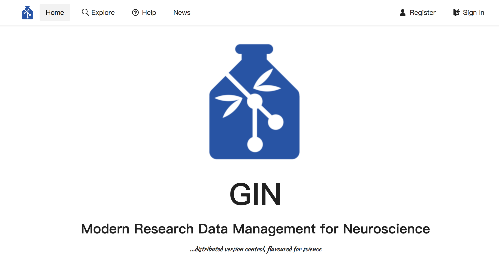
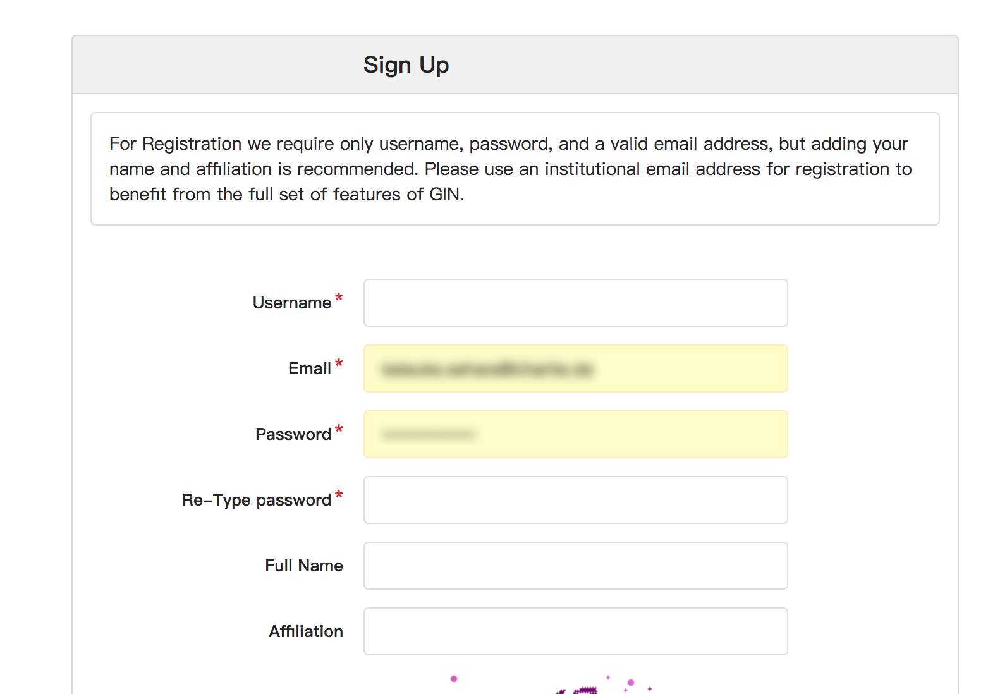
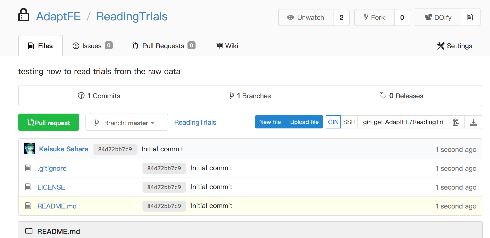

Introduction to Gin
==============================

.. _registration:

Get registered as a Gin user
-----------------------------

**You have to obtain an account in Gin in order to work with Gin repositories**.

Click on the "Register" button on the top-right corner of the `Gin web site <https://gin.g-node.org>`_,
and fill in the necessary information.

After verification of your e-mail address, you can start working with Gin.

.. note::

   You will have much more previliges if you sign up with your
   institutional e-mail address (e.g. ``<yourname>@hu-berlin.de``).

.. _user-interfaces:

User interface options
-----------------------

There are three options as to how to manage Gin repositories.
In principle, *almost* all the repository actions can be performed through any interfaces.

.. caution::

   For the time being, **WinGIN and Gin CLI cannot work across a firewall**
   (i.e. no connection through the Charité wired internet).

   You have to work through the web interface to do so,
   though there is some limitations (<100 files/commit, 10 GB/file-upload).

Gin web interface
^^^^^^^^^^^^^^^^^^

You can get access to it by going to https://gin.g-node.org/ :

WinGIN desktop client (Windows only)
^^^^^^^^^^^^^^^^^^^^^^^^^^^^^^^^^^^^^

Refer to `the corresponding section <WinGIN>`_.

Gin command-line interface (CLI)
^^^^^^^^^^^^^^^^^^^^^^^^^^^^^^^^^

Cross-platform, but you have to work with a command-line interface.
